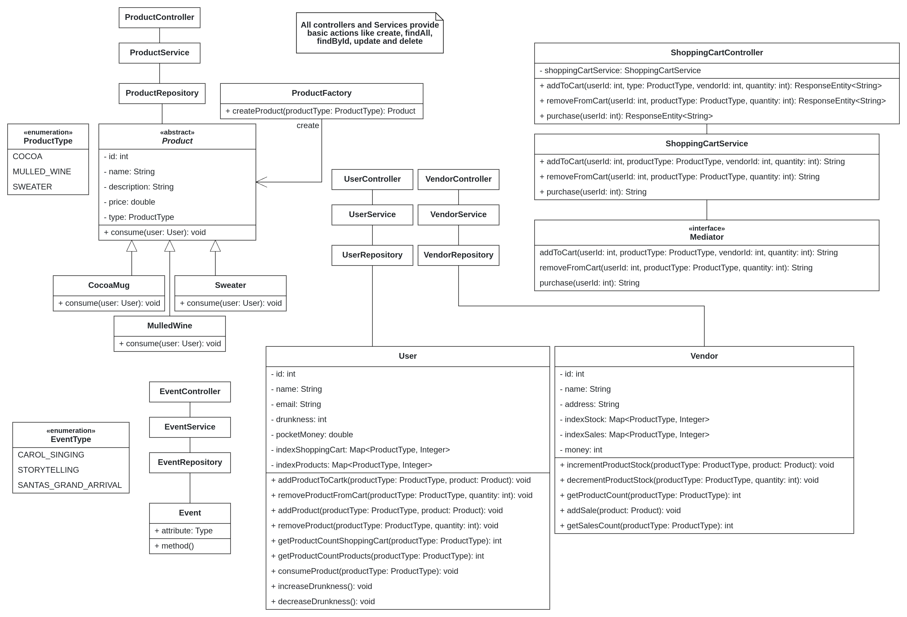

## System description
Project developed for the TUM optional bonus in PSE W24/25.

This system simulates a Christmas market where users can purchase products from different vendors. The system includes entities such as `User`, `Vendor`, `Product`, and `Event`. Users can add products to their shopping cart, remove them, and proceed to checkout. The system also tracks the sales made by each vendor and allows users to consume the products they have purchased. The main goal is to provide a seamless shopping experience for users while managing the inventory and sales for vendors.

## Features

- User registration and management
- Vendor registration and management
- Product creation and management
- Adding products from different vendors to an user's shopping cart
- Removing products from an user's shopping cart
- Checkout process with payment handling
- Tracking sales for each vendor
- Management of the stock of each vendor
- Consuming purchased products
- Event creation and management

## UML

Below is a UML class diagram that provides an overview of the system:

## Usage instructions

### Requirements

- Java 17
- Maven or Gradle
- Spring Boot

### Running the system locally

When running the program locally, you will be able to access the associated database where you can see the results of the test operations and the storage of entities. To run it locally, simply press the play button once the dependencies mentioned in the build.gradle file are satisfied.

It can be runned aswell following these commands:
./gradlew clean build
./gradlew bootRun

Access the application: Open your web browser and go to http://localhost:8080.

The H2 database console is available at http://localhost:8080/h2-console.
Default database URL: jdbc:h2:mem:testdb
Default username: sa
Default password: (leave it blank)

